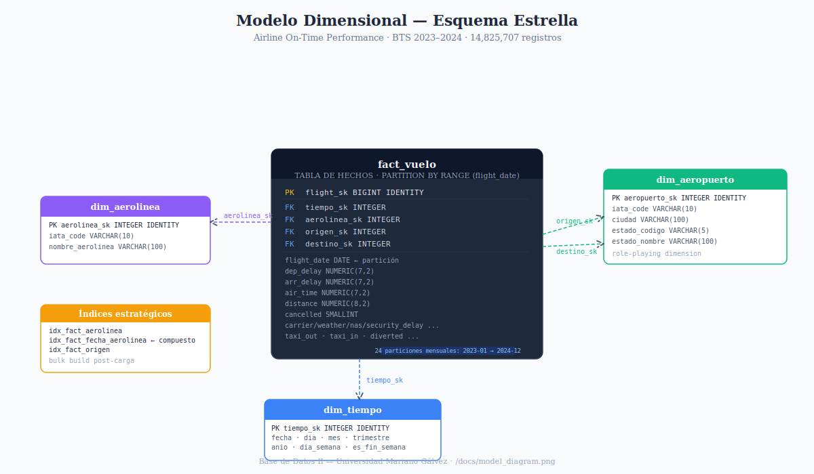

# Proyecto Final — Base de Datos II (031)
**Universidad Mariano Gálvez de Guatemala**  
**Facultad de Ingeniería en Sistemas de Información y Ciencias de la Computación**

---

## Descripción general

Este proyecto implementa un pipeline ETL y un Data Warehouse analítico sobre el dataset **Airline On-Time Performance** del **Bureau of Transportation Statistics (BTS / U.S. DOT)**.

El flujo completo incluye:

1. **Extracción** automática de archivos mensuales 2023–2024  
2. **Transformación** y limpieza de datos  
3. **Carga** a PostgreSQL en un esquema dimensional optimizado  
4. **Análisis técnico** con `EXPLAIN ANALYZE`  
5. **Dashboard** conectado directamente a PostgreSQL  

---

## Dataset

**Fuente:** Airline On-Time Performance — Bureau of Transportation Statistics (BTS / U.S. DOT)  
**Años:** 2023 y 2024 (24 meses completos)  
**Volumen final cargado:** **14,825,707 registros** en `dw.fact_vuelo`

**URL base de descarga:**
```text
https://transtats.bts.gov/PREZIP/On_Time_Marketing_Carrier_On_Time_Performance_Beginning_January_2018_{year}_{month}.zip
```

---

## Preguntas de negocio

Las preguntas de negocio definidas para el dashboard son:

1. ¿Qué aerolínea tiene el mayor retraso promedio de llegada en 2023–2024?
2. ¿Cuál es la tendencia mensual de retrasos a lo largo de los dos años?
3. ¿Qué aeropuertos de origen concentran más cancelaciones?
4. ¿Cómo se distribuyen los retrasos de llegada en el período analizado?

---

## Estructura del repositorio

```text
PROYECTO-BDII/
├── docs/
│   ├── airline_dashboard.pdf
│   ├── dashboard-doc.md
│   ├── model_diagram.png
│   └── technical-decisions.md
├── etl/
│   ├── extract.py
│   ├── transform.py
│   └── load.py
├── sql/
│   ├── ddl_schema.sql
│   └── queries_analyze.sql
├── staging/
│   ├── raw/
│   ├── extracted/
│   ├── transformed/
│   ├── extract.log
│   ├── transform.log
│   └── load.log
├── airline_dashboard.twb
├── requirements.txt
└── README.md
```

---

## Requisitos

### Software necesario
- Python 3.9+
- Docker Desktop
- PostgreSQL ejecutándose en contenedor Docker
- Tableau Desktop o Power BI Desktop

### Dependencias Python
```bash
pip install -r requirements.txt
```

**Contenido de `requirements.txt`:**
```text
requests
pandas
pyarrow
psycopg2-binary
```

---

## Configuración antes de ejecutar

### 1. Levantar PostgreSQL en Docker
```bash
docker run --name airline-dw ^
  -e POSTGRES_PASSWORD=postgres ^
  -e POSTGRES_DB=airline_dw ^
  -p 5433:5432 ^
  -d postgres:17
```

### 2. Configurar credenciales en `etl/load.py`
```python
DB_CONFIG = {
    "host": "127.0.0.1",
    "port": 5433,
    "dbname": "airline_dw",
    "user": "postgres",
    "password": "postgres"
}
```

### 3. Ejecutar el DDL una vez antes de la carga
El archivo `sql/ddl_schema.sql` se ejecuta **una vez** para crear:

- esquema `dw`
- tablas dimensionales
- tabla de hechos
- particiones mensuales
- claves foráneas
- índices

Ejemplo usando Docker:

```bash
docker cp .\sql\ddl_schema.sql airline-dw:/ddl_schema.sql
docker exec airline-dw psql -U postgres -d airline_dw -f /ddl_schema.sql
```

---

## Ejecución del pipeline ETL

El pipeline se ejecuta desde la raíz del proyecto:

```bash
python etl/extract.py
python etl/transform.py
python etl/load.py
```

O en una sola línea:

```bash
python etl/extract.py && python etl/transform.py && python etl/load.py
```

> **Importante:** los scripts deben ejecutarse desde la carpeta raíz del proyecto, no desde dentro de `etl/`.

### Qué hace cada script

#### `extract.py`
Descarga automáticamente los 24 archivos ZIP del dataset y extrae los CSV en `staging/extracted`.

#### `transform.py`
Limpia datos, resuelve problemas de calidad, construye dimensiones y genera archivos Parquet en `staging/transformed`.

#### `load.py`
Carga dimensiones y tabla de hechos a PostgreSQL usando `COPY FROM STDIN`.

> En la versión actual del proyecto, `load.py` **no ejecuta automáticamente** `ddl_schema.sql`.  
> El esquema se crea previamente y luego `load.py` realiza la carga masiva.

> Si la base ya fue cargada, **no debe ejecutarse nuevamente `load.py` sobre la misma base** sin reinicializar el esquema, porque intentará recargar datos ya existentes.

---

## Resultados de carga obtenidos

Después de la carga, se obtuvo el siguiente volumen:

| Tabla | Filas | Descripción |
|---|---:|---|
| `dw.dim_tiempo` | 731 | Dimensión de tiempo con granularidad diaria |
| `dw.dim_aerolinea` | 10 | Aerolíneas de marketing |
| `dw.dim_aeropuerto` | 362 | Dimensión de aeropuertos |
| `dw.fact_vuelo` | 14,825,707 | Tabla de hechos particionada por `flight_date` |

---

## Modelo dimensional

Se utilizó un **esquema estrella** con:

- **1 tabla de hechos:** `dw.fact_vuelo`
- **3 dimensiones:** `dw.dim_tiempo`, `dw.dim_aerolinea`, `dw.dim_aeropuerto`



---

## Particionamiento e índices

### Particionamiento
La tabla `dw.fact_vuelo` está particionada por rango sobre `flight_date` con granularidad **mensual**.

**Total de particiones:** 24  
Desde `dw.fact_vuelo_2023_01` hasta `dw.fact_vuelo_2024_12`

### Índices existentes
- `idx_fact_aerolinea`
- `idx_fact_fecha_aerolinea`
- `idx_fact_origen`

### Llaves foráneas existentes
- `fk_fact_tiempo`
- `fk_fact_aerolinea`
- `fk_fact_origen`
- `fk_fact_destino`

---

## Evidencia técnica

Se validó el comportamiento del DW con `EXPLAIN ANALYZE`, demostrando:

- **partition pruning** en consultas con filtro por fecha
- uso del **índice compuesto** `idx_fact_fecha_aerolinea` en consultas selectivas
- consultas paralelas sobre particiones trimestrales
- mejora de rendimiento en consultas analíticas

Ver evidencia completa en:

```text
docs/technical-decisions.md
sql/queries_analyze.sql
```

---

## Dashboard

**Archivo:** `airline_dashboard.twb`  
**Herramienta:** Tableau Desktop  
**Conexión:** PostgreSQL, esquema `dw`, base `airline_dw`

### Visualizaciones propuestas

1. **Tendencia temporal:** retraso promedio mensual 2023–2024  
2. **Comparativa de categorías:** retraso promedio por aerolínea  
3. **KPI agregado:** total de vuelos, retraso promedio general y porcentaje de cancelaciones  
4. **Distribución:** distribución de retrasos de llegada (`arr_delay`)  

### Filtros interactivos
- rango de fechas
- aerolínea
- aeropuerto de origen

> Para abrir el dashboard, el contenedor `airline-dw` debe estar activo y la base cargada.

---

## Verificación post-carga

Consultas de validación:

```sql
SELECT COUNT(*) FROM dw.dim_tiempo;
SELECT COUNT(*) FROM dw.dim_aerolinea;
SELECT COUNT(*) FROM dw.dim_aeropuerto;
SELECT COUNT(*) FROM dw.fact_vuelo;

SELECT conname
FROM pg_constraint
WHERE conrelid = 'dw.fact_vuelo'::regclass
ORDER BY conname;

SELECT indexname
FROM pg_indexes
WHERE schemaname = 'dw'
  AND tablename = 'fact_vuelo'
ORDER BY indexname;

SELECT
    inhparent::regclass AS tabla_padre,
    inhrelid::regclass AS particion
FROM pg_inherits
WHERE inhparent = 'dw.fact_vuelo'::regclass
ORDER BY particion;
```

---

## Notas de ejecución

- En Windows, `extract.py` puede mostrar advertencias de codificación en consola por el símbolo `✓`, pero la descarga y extracción se completan correctamente.
- Para evitar conflictos con otros PostgreSQL locales, este proyecto se ejecutó usando el puerto **5433**.
- Si el contenedor Docker se elimina, la base debe reconstruirse ejecutando nuevamente `ddl_schema.sql` y `load.py`.

---

## Autores

Proyecto desarrollado para el curso **Base de Datos II (031)**.
